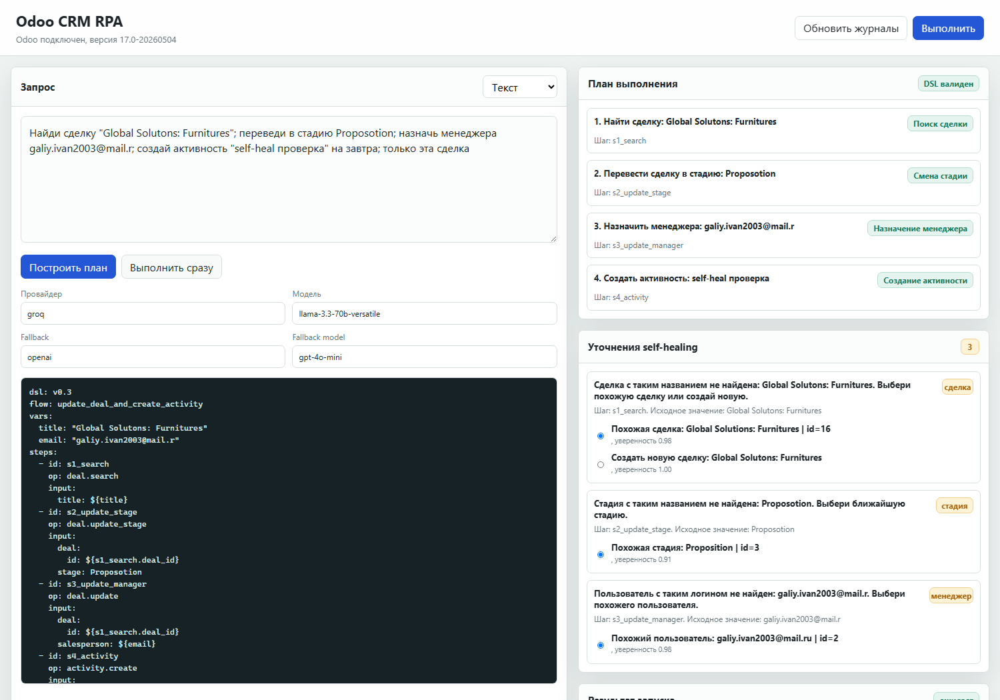
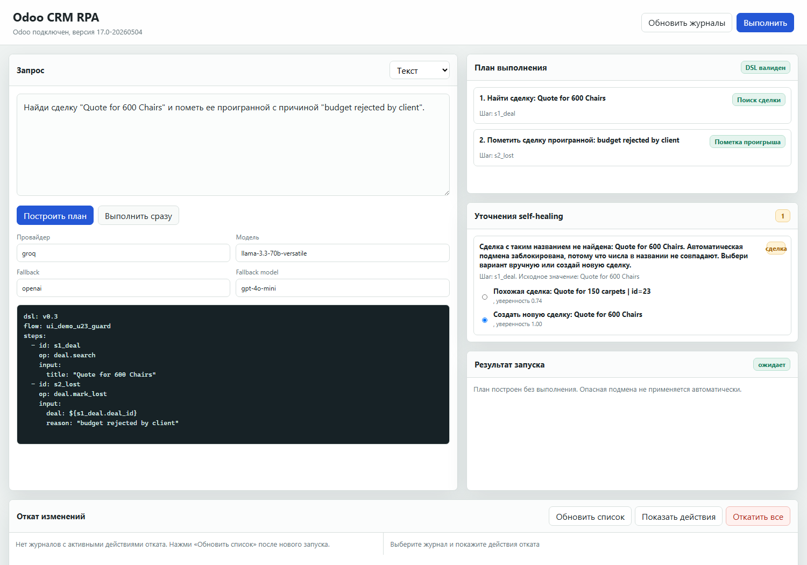
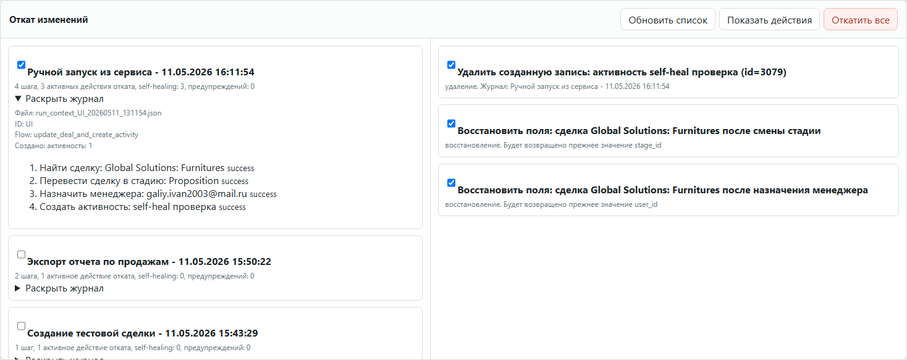

# Odoo CRM RPA with LLM DSL and self-healing

Прототип для ВКР: пользователь формулирует CRM-задачу обычным текстом, система строит YAML DSL, показывает понятный план, выполняет сценарий в Odoo CRM через XML-RPC, ведет аудит и позволяет откатить сделанные изменения.

В репозиторий входят код, основной eval-набор, retrieval-пул без утечки, baseline YAML для воспроизводимых execution-прогонов и краткие инструкции. Локальные отчеты, логи, текст ВКР, презентации, `.env` и выгрузки исключены через `.gitignore`.

## Что умеет система

- Принимать запрос на естественном языке или готовый YAML DSL.
- Генерировать промежуточный DSL для CRM-действий.
- Проверять YAML на parse/schema/contract корректность.
- Выполнять операции в Odoo CRM: сделки, стадии, активности, встречи, контакты, коммерческие предложения, отчеты и уведомления.
- Делать controlled self-healing для опечаток в названиях сделок, стадий и логинов.
- Перед выполнением строить план без записи в Odoo, чтобы человек мог проверить действия и выбрать варианты self-healing.
- Показывать топ-кандидатов для рискованных исправлений и давать вариант создать новую сделку, если точная сделка не найдена.
- Не выполнять автоматическую подмену объекта, если есть риск wrong-object success.
- Писать `run_context` с трассами шагов, self-healing events, alerts и rollback actions.
- Откатывать выбранный запуск через UI: созданные записи, измененные поля и пользовательские выгрузки.

## Быстрый запуск

```powershell
python -m pip install -r requirements.txt

Set-Location .\odoo_ocr_docker
docker compose up -d --build

Set-Location ..
python -m uvicorn rpa_service:app --host 127.0.0.1 --port 8077
```

Интерфейс:

```text
http://127.0.0.1:8077
```

Полная инструкция: [RUN_INSTRUCTIONS.md](RUN_INSTRUCTIONS.md).

## Демо-сценарии

Self-healing с опечатками:

```text
Найди сделку "Global Solutons: Furnitures"; переведи в стадию Proposotion; назначь менеджера galiy.ivan2003@mail.r; создай активность "self-heal проверка" на завтра; только эта сделка
```

Система показывает кандидатов:

- `Global Solutions: Furnitures`
- `Proposition`
- `galiy.ivan2003@mail.ru`

Риск подмены объекта:

```text
Найди сделку "Quote for 600 Chairs" и пометь ее проигранной с причиной "budget rejected by client".
```

Если точной сделки нет, UI показывает похожие сделки как варианты ручного выбора, например `Quote for 150 carpets`, но автоматический self-healing сам такую подмену не делает. Также предлагается создать новую сделку `Quote for 600 Chairs`.

## Интерфейс

План выполнения и выбор self-healing:



Ручное уточнение для риска U23:



Откат изменений с раскрытием журнала и выбором действий:



В UI есть два основных режима работы:

- `Построить план` - сгенерировать DSL, показать план и self-healing уточнения без записи в Odoo.
- `Выполнить` / `Выполнить сразу` - выполнить сценарий с выбранными уточнениями.

В блоке отката журналы можно обновить, раскрыть, посмотреть шаги и откатить все активные действия выбранного запуска. Сервер повторно проверяет, что каждое действие отката действительно принадлежит выбранному `run_context`. Rollback является компенсирующим и покрывает действия, зафиксированные в `run_context`; полная транзакционная гарантия восстановления всей базы Odoo не заявляется.

## Данные и метрики

Основной eval-набор:

- `combined_api_eval_odoo_API.csv` - 58 сценариев.
- `manual_review_all_scenarios.csv` - ручная semantic-разметка всех сценариев.
- `manual_summary.json` - итоговые ручные метрики.
- `retrieval_pool_no_leak_odoo_API.csv` - независимый retrieval-пул без прямой утечки eval-примеров.
- `preds_combined_baseline/` - baseline YAML DSL для воспроизводимых execution-абляций без повторной траты LLM-токенов.

Ключевые результаты текущей ручной оценки:

| Метрика | Значение |
| --- | ---: |
| `manual_strict_task_success_rate` | 0.9483 |
| `manual_entity_resolution_accuracy` | 0.9655 |
| `manual_wrong_object_success_rate` | 0.0000 |
| `manual_postcondition_satisfaction_rate` | 0.9483 |
| сценарии с заранее заложенной проверкой self-healing | 21 / 58 |

`manual_entity_resolution_accuracy` считается успешной, когда существующая целевая сущность найдена и выбрана корректно. Ошибки параметров действия, например отсутствующая стадия, учитываются в strict/postcondition, но не обязательно снижают entity-resolution. Safe-failure для отсутствующей целевой сущности снижает strict/entity метрики, но не считается wrong-object success. Поэтому U03 и U23 дают `strict=0`, `entity=0`, `wrong_object=0`: система не решила бизнес-задачу, но и не изменила похожую сделку. U17 может иметь `entity=1` при `strict/postcondition=0`: целевая сделка выбрана корректно, но нужная стадия отсутствует.

В batch-режиме high-confidence self-healing исправления применяются автоматически и журналируются. В интерактивном UI рискованные случаи показываются как варианты подтверждения; опасная semantic substitution блокируется ограничителями.

Абляции запускаются локально через `ablation_runner.py`. Локальные папки `ablation_runs/`, `full_eval_runs/`, `logs/` и `artifacts/` не входят в Git, потому что это воспроизводимые рабочие результаты.

## Основные файлы

- `llm.py` - генерация YAML DSL, retrieval и repair.
- `odoo_llm_pipeline.py` - интегрированный pipeline NL -> DSL -> execution.
- `odoo_rpa.py` - исполнитель Odoo API, handlers операций, run_context.
- `self_healing_policy.py` - политика self-healing, fuzzy scoring и numeric guard.
- `odoo_rollback.py` - откат по журналу действий.
- `execution_eval.py` - полный execution-eval и ручные поля.
- `ablation_runner.py` - запуск абляций.
- `rpa_service.py` - backend сервиса.
- `rpa_ui/` - русский frontend.
- `odoo_ocr_docker/` - Docker Compose окружение Odoo + PostgreSQL.

## Безопасность

Реальные ключи и пароли хранятся только в `.env`. Файлы `.env` игнорируются Git. Шаблон переменных без секретов лежит в `.env.example`.
